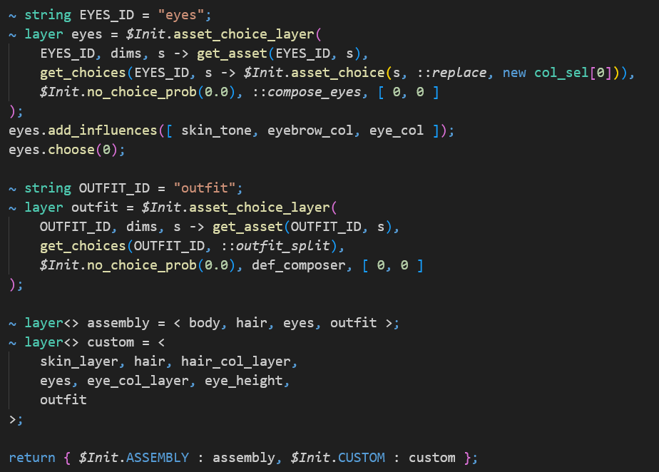

# DeltaScript for *Top Down Sprite Maker*: VS Code Syntax Highlighting Extension

This VS Code extension provides syntax highlighting for the extension flavour of the lightweight scripting language [*DeltaScript*](https://github.com/jbunke/deltascript) for [*Top Down Sprite Maker*](https://github.com/jbunke/tdsm), the bespoke pixel art character creation program.

## Features and future

The extension adds syntax highlighting to plain text files with the extension `.tds`:

For now, the extension is limited to syntax highlighting and rudimentary QoL features like automatic closing parentheses and brackets. Eventually -- *once I learn [LSP](https://microsoft.github.io/language-server-protocol/)* -- I plan to turn it into a fully functional language server that supports code completion and linting.

## Learn more

To learn more about scripting in *Top Down Sprite Maker*, please read its [API specification](https://github.com/jbunke/tdsm-api/blob/master/spec/README.md).
